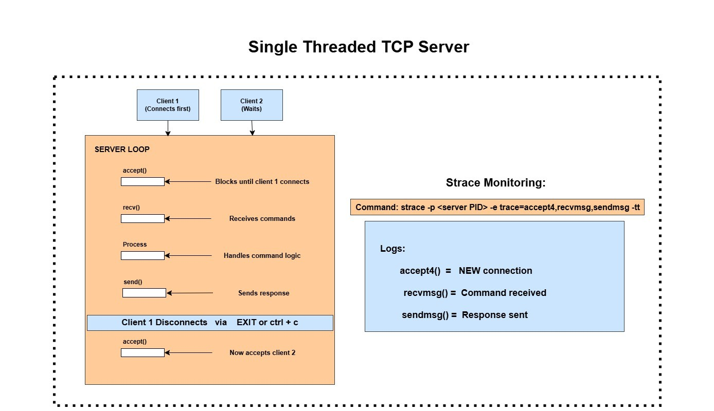
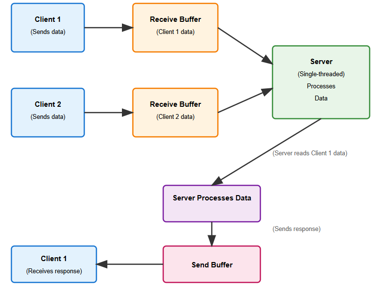
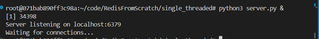
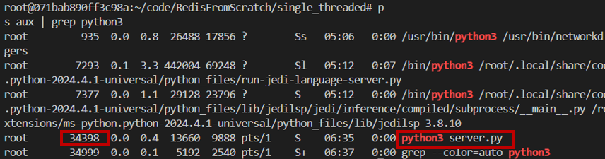
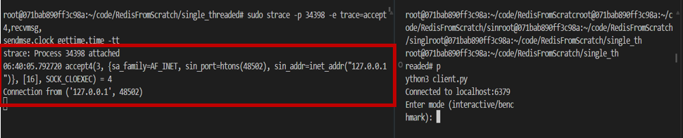
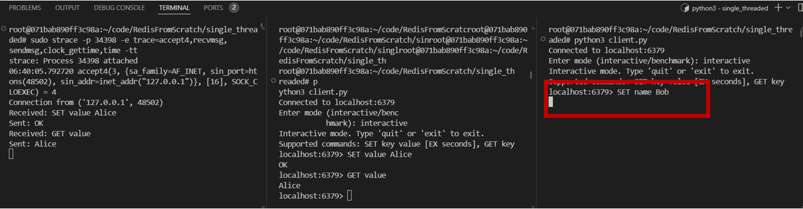
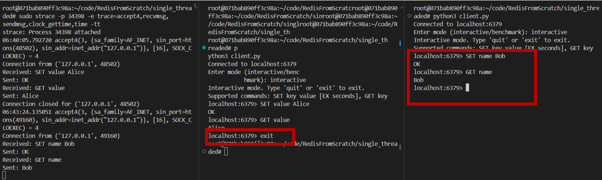
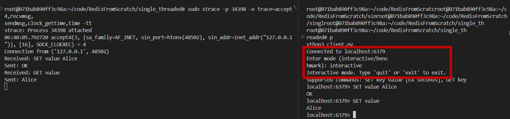
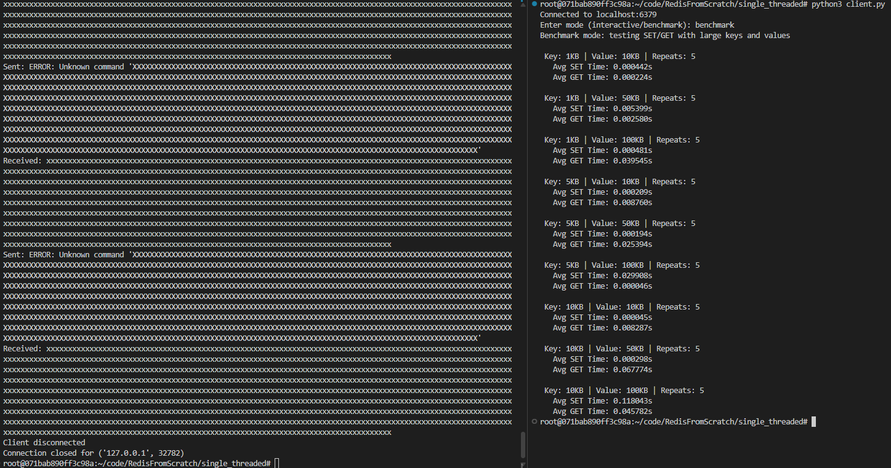
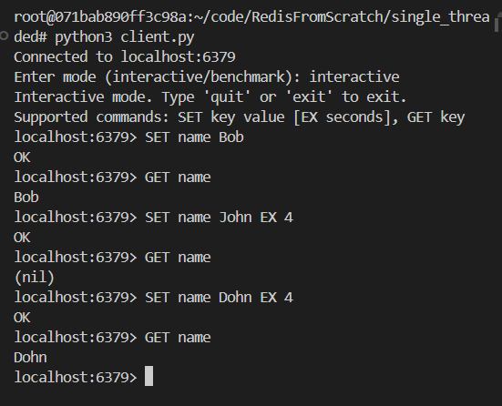

## Since we are building Redis from scratch, we'll first implement a basic TCP server. This server will handle only one client at a time. If multiple clients try to connect, the server will block and wait until the current client is done.

## So, let's get started!

###  First, let's go over some basic concepts

### TCP_Server: 

* TCP (Transmission Control Protocol) is a reliable, connection-based protocol used for sending data between devices on a network. Guarantees: **no data loss**, **correct order**, **connection-based**.

### Used in applications: HTTP, FTP, Redis.
---

### Why Redis uses TCP?

* **Reliable**: No missing commands.
* **Ordered**: Commands run in correct order.
* **Persistent**: Keeps client connected.
* **Cross-machine Communication:** Redis works over LAN/WAN; TCP ensures safe delivery.

---

### What is a Single-threaded TCP Server?

* Uses **one thread only**.
* Accepts multiple clients but handles **one client at a time**.
* Simple and fast for small tasks.

---

### Implementation of a Single-threaded TCP Server:
## Completed the following tasks:

- ✅ TCP Server using socket module
- ✅ Multiple client acceptance (single-threaded)
- ✅ REPL-like command processing (SET, GET)
- ✅ Single-threaded request-response loop
- ✅ In-memory key-value store with dictionary
- ✅ Expiration logic (EXPIRE/EX parameter)
- ✅ Benchmark with large keys  ei task gulo complete 

## Workflow Diagram 



## Explanation:

#### 1. Server Loop
**Listening:** The server binds to 6379 port and listens for connections using socket module

**Blocking accept():** accept() call waits for a client to connect. Only one client is handled at a time.

**Command Processing:**
1. recv(): Reads commands from the client ( SET name Alice)
2. Process Command: Executes logic (stores key-value pairs in an in-memory dictionary)
3. send(): Sends responses back ( OK or (nil))

**Client Disconnection:** Client disconnects by sending EXIT or ctrl+c, freeing the server to accept the next client.

#### 2. Client Behavior

**Client 1:** Connects first and interacts with the server (sending SET or GET commands)

**Client 2:** Waits in the kernel’s TCP receive buffer until Client 1 disconnects, due to the blocking accept().

#### 3. TCP Packet Flow



It shows the packet flow and the connection between OS and TCP server. 

* Receive Buffer: Incoming client data (commands) is stored in the kernel’s TCP receive buffer until recv() fetches it.
* Send Buffer: Responses are placed in the kernel’s send buffer by send() and transmitted to the client.
* Blocking Nature: While Client 1 is active, Client 2’s data waits in the receive buffer, illustrating the single-threaded limitation.

#### 4. `strace` Monitoring: Logs system calls to confirm the server’s blocking behavior and track command processing.
   
### File Structure 

```
RedisFromScratch/TCP_Server/
├── server.py       # Runs the TCP server
├── client.py       # client to test server

```
## imaportant code Explanation: 


## **1. TCP Server Creation**

```python
self.socket = socket.socket(socket.AF_INET, socket.SOCK_STREAM)
self.socket.bind((self.host, self.port))
self.socket.listen(1)  # Single client at a time
```

**Explanation:**
Creates a TCP socket, binds it to the host and port, and starts listening for incoming client connections. The server handles **one client at a time** (single-threaded).

---

## **2. Client Handling Loop**

```python
while True:
    client_socket, client_address = self.socket.accept()
    self.handle_client(client_socket)
```
 **Explanation:**
Accepts one client connection, handles its request fully, and then accepts the next. Clients are processed **sequentially**, not concurrently.

---

## **3. In-Memory Dictionary Store**

```python
self.storage: Dict[str, str] = {}      # Key-value store
self.expire: Dict[str, float] = {}     # Expiry timestamps for keys
```
 **Explanation:**
Stores all key-value data in memory using Python dictionaries. A separate dictionary is used to keep track of keys that should expire using the EX (expire) option.

---

## **4. Command Parsing (SET, GET, EX)**

```python
def process_command(self, command: str) -> str:
    parts = command.split()
    cmd = parts[0].upper()
    if cmd == "SET": return self.handle_set(parts[1:])
    elif cmd == "GET": return self.handle_get(parts[1:])
```

**Explanation:**
Parses user commands like `SET key value EX seconds` or `GET key`, and routes them to the appropriate handler function. Commands are case-insensitive.

---

## **5. Expiration Logic**

```python
def cleanup_expired_keys(self):
    now = time.time()
    expired_keys = [k for k, exp in self.expire.items() if exp <= now]
    for key in expired_keys:
        self.storage.pop(key, None)
        self.expire.pop(key, None)
```

 **Explanation:**
Before processing any new command, the server checks if any stored keys have expired and removes them automatically.

---

## **6. Interactive REPL Mode (client.py)**

```python
def interactive_mode(self):
    command = input(f"{self.host}:{self.port}> ").strip()
    response = self.send_command(command)
```

 **Explanation:**
Allows the user to interact with the server in real time. You can type `SET` or `GET` commands and see responses just like in a real Redis CLI.

---

## **7. Benchmarking with Large Keys and Values**

```python
def benchmark_mode(self):
    key_sizes = [1, 5, 10]
    value_sizes = [10, 50, 100]
    repeat = 5
    ...
    start = time.time()
    self.socket.send((f"SET {key} {value}\n").encode('utf-8'))
    self.socket.recv(4096)
    total_set += (time.time() - start)
```

 **Explanation:**
This mode automatically tests how fast the server can handle large key-value pairs by measuring the average time for `SET` and `GET` operations. Useful for performance testing.

---


## Process to Test the TCP Server: 
#### **Step 1: Start the Server**

  ```bash
    python3 server.py &
  ```
  - Starts the server in the background on `localhost:6379`.
  - The `&` allows the terminal to remain usable.

    **Expected output**
   


#### **Step 2: Use `strace` to Log Server Activity**
- **Install `strace` (if not installed):**
  
    ```bash
    sudo apt update
    sudo apt install strace
    ```
  - Updates package lists and installs `strace` to trace system calls.
- **Find Server PID:**
  
    ```bash
    ps aux | grep python3
    # or
    pidof python3
    ```
  **Expected output**

  
  - Identifies the process ID (PID) of the running server. Here, 34398 is the PID for server.py
- **Run `strace`:**
  
    ```bash
    sudo strace -p <PID> -e trace=accept4,recvmsg,sendmsg,clock_gettime,time -tt
    ```
  - Traces `accept4` (new connection), `recvmsg` (receive commands), and `sendmsg` (send responses) system calls with timestamps (`-tt`). `clock_gettime` Used when time.time() or expiration logic captures a timestamp. `time` Used to fetch/check current time (e.g., for key expiration checks).

  **Expected Output:**
  

  - Output shows when the server accepts connections and processes commands, helping confirm blocking behavior.


#### **Step 3: Test with Multiple Clients**
- Open multiple terminal windows.
- In each terminal, run:
  ```bash
  python3 client.py
  ```
  - Enter commands like `SET key value` and `GET key` in the interactive mode.
  - First client connects and holds the server. Subsequent clients will wait (block) until the first client's session ends (e.g., after typing `exit`).
- Check `strace` output:
  - First `accept4` for the initial client, followed by `recvmsg` and `sendmsg`.
  - Next `accept4` appears only after the first client disconnects, proving single-threaded blocking.

**Expected Output**




This image shows a **single-threaded TCP server** where only **one client is served at a time**:

### strace Terminal:

* Shows `accept4`, `recvmsg`, `sendmsg`, `clock_gettime`, and `time` calls.
* Logs client connections, command handling, and key expiration in real time.

### Client 1:

* Runs `SET` and `GET` with and without `EX`.
* `GET` returns `(nil)` after key expires.
* Stays connected—blocks server for other clients.

### Client 2:

* Starts during Client 1 session—**blocked**.
* Only works **after Client 1 exits**.

Confirms server is **single-threaded** and **blocking**, handling one client at a time with correct expiration logic.



 



# **Handle Port Conflicts**
- **Check if Port 6379 is in Use:**
  - Command:
    ```bash
    sudo netstat -tulnp | grep 6379
    ```
  - Lists processes using port 6379 (shows PID if active).
- **Kill the Conflicting Process:**
  - Command:
    ```bash
    sudo kill -9 <PID>
    ```
  - Replaces `<PID>` with the process ID from the previous step.
- **Restart the Server:**
  - Command:
    ```bash
    python3 server.py &
    ```
  - Starts a fresh server instance.

