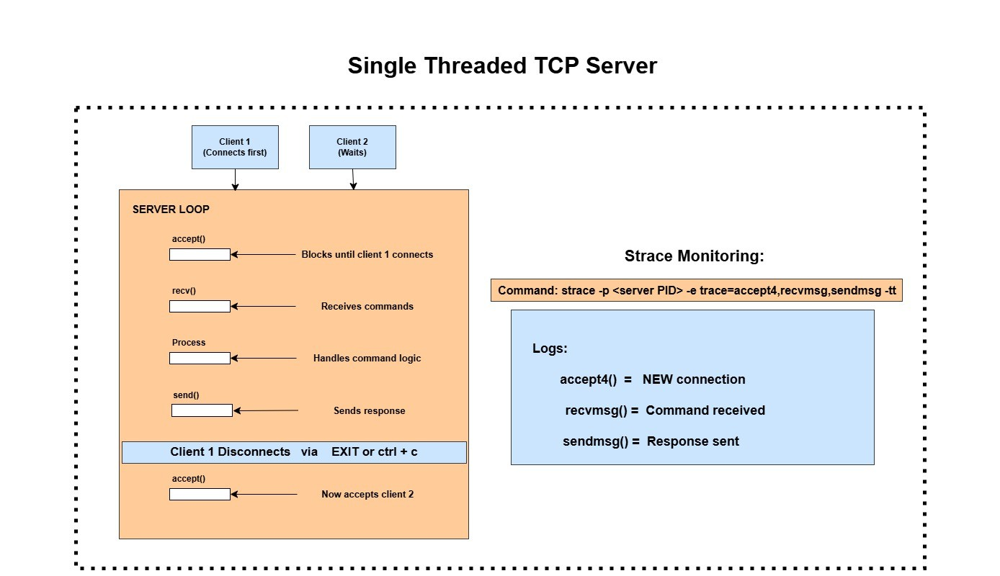
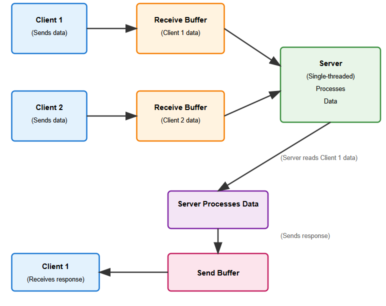
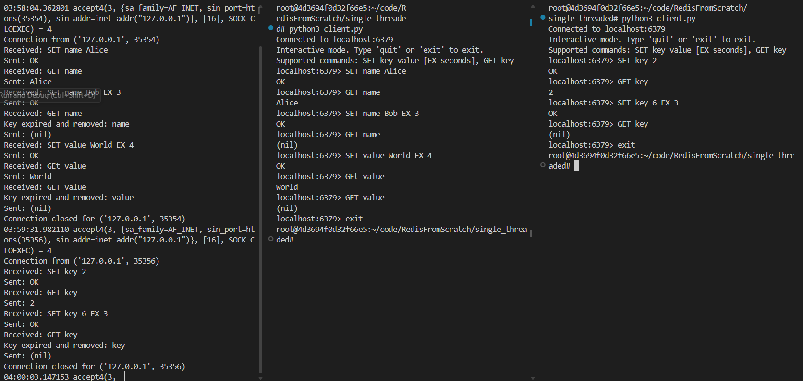

## Since we are building Redis from scratch, we'll first implement a basic TCP server. This server will handle only one client at a time. If multiple clients try to connect, the server will block and wait until the current client is done.

## So, let's get started!

###  First, let's go over some basic concepts

### TCP_Server: 

* TCP (Transmission Control Protocol) is a reliable, connection-based protocol used for sending data between devices on a network. Guarantees: **no data loss**, **correct order**, **connection-based**.

### Used in applications: HTTP, FTP, Redis.
---

### Why Redis uses TCP?

* **Reliable**: No missing commands.
* **Ordered**: Commands run in correct order.
* **Persistent**: Keeps client connected.
* **Cross-machine Communication:** Redis works over LAN/WAN; TCP ensures safe delivery.

---

### What is a Single-threaded TCP Server?

* Uses **one thread only**.
* Accepts multiple clients but handles **one client at a time**.
* Simple and fast for small tasks.

---

### Implementation of a Single-threaded TCP Server:
## Workflow Diagram 



## Explanation:

#### 1. Server Loop
**Listening:** The server binds to 6379 port and listens for connections using socket module

**Blocking accept():** accept() call waits for a client to connect. Only one client is handled at a time.

**Command Processing:**
1. recv(): Reads commands from the client ( SET name Alice)
2. Process Command: Executes logic (stores key-value pairs in an in-memory dictionary)
3. send(): Sends responses back ( OK or (nil))

**Client Disconnection:** Client disconnects by sending EXIT or ctrl+c, freeing the server to accept the next client.

#### 2. Client Behavior

**Client 1:** Connects first and interacts with the server (sending SET or GET commands)

**Client 2:** Waits in the kernel’s TCP receive buffer until Client 1 disconnects, due to the blocking accept().

#### 3. TCP Packet Flow



It shows the packet flow and the connection between OS and TCP server. 

* Receive Buffer: Incoming client data (commands) is stored in the kernel’s TCP receive buffer until recv() fetches it.
* Send Buffer: Responses are placed in the kernel’s send buffer by send() and transmitted to the client.
* Blocking Nature: While Client 1 is active, Client 2’s data waits in the receive buffer, illustrating the single-threaded limitation.

#### 4. `strace` Monitoring: Logs system calls to confirm the server’s blocking behavior and track command processing.
   
### File Structure 

```
RedisFromScratch/TCP_Server/
├── server.py       # Runs the TCP server
├── client.py       # client to test server

```
**Server side:**

* Uses socket to accept connections from clients and send/receive data.

* Uses SET and GET commands to store data and retrieve it upon requests.

**Client side:**

* Uses socket to connect to the server and send commands.

* Uses SET and GET commands to send data to the server and receive responses.


## **TCP Server Setup**

```python
self.socket = socket.socket(socket.AF_INET, socket.SOCK_STREAM)
self.socket.bind((self.host, self.port))
self.socket.listen(1)  #single client connection
```

### ➤ **Explanation:**

* Initializes a TCP socket server.
* `SOCK_STREAM` → stream-based (TCP).
* `bind()` attaches the server to the host and port.
* `listen(1)` ensures only one client can connect at a time 

---

## **SET Command Logic**

```python
def handle_set(self, args):
    ...
    self.storage[key] = value
```

### ➤ **Explanation:**

* Stores the key-value pair in `self.storage`, which is an in-memory dictionary.
* Supports optional expiration via `EX` (described below).

---

## **SET with EXPIRE Support**

```python
if option == "EX":
    seconds = int(args[i])
    expire_time = time.time() + seconds
    self.expire[key] = expire_time
```

### ➤ **Explanation:**

* When the client issues a command like `SET name John EX 10`, it:

  * Parses `"EX"` and extracts the `seconds`.
  * Calculates absolute expiration time (`current_time + seconds`).
  * Stores it in `self.expire[key]`.

---

## **GET Command Logic with Expiration Check**

```python
if key in self.expire and self.expire[key] <= time.time():
    self.storage.pop(key)
    self.expire.pop(key)
    return "(nil)"
```

### ➤ **Explanation:**

* Before returning a value, the server checks if the key has expired.
* If expired:

  * Deletes it from both `storage` and `expire` dicts.
  * Returns `"(nil)"` (mimicking Redis behavior).

---

## **Expired Key Cleanup (Per Command)**

```python
self.cleanup_expired_keys()
```

### ➤ **Explanation:**

* Called before processing every client command.
* Iterates through `self.expire` and removes keys that have passed their expiration time.

---

## Process to Test the TCP Server: 
#### **Step 1: Start the Server**
- Command: `python3 server.py &`
  - Starts the server in the background on `localhost:6379`.
  - The `&` allows the terminal to remain usable.

#### **Step 2: Use `strace` to Log Server Activity**
- **Install `strace` (if not installed):**
  - Commands:
    ```bash
    sudo apt update
    sudo apt install strace
    ```
  - Updates package lists and installs `strace` to trace system calls.
- **Find Server PID:**
  - Commands:
    ```bash
    ps aux | grep python3
    # or
    pidof python3
    ```
  - Identifies the process ID (PID) of the running server (e.g., `38872`).
- **Run `strace`:**
  - Command:
    ```bash
    sudo strace -p 33339 -e trace=accept4,recvmsg,sendmsg,clock_gettime,time -tt
    ```
  - Traces `accept4` (new connection), `recvmsg` (receive commands), and `sendmsg` (send responses) system calls with timestamps (`-tt`). `clock_gettime` Used when time.time() or expiration logic captures a timestamp. `time` Used to fetch/check current time (e.g., for key expiration checks).
  - Output shows when the server accepts connections and processes commands, helping confirm blocking behavior.

#### **Step 3: Test with Multiple Clients**
- Open multiple terminal windows.
- In each terminal, run:
  ```bash
  python3 client.py
  ```
  - Enter commands like `SET key value` and `GET key` in the interactive mode.
  - First client connects and holds the server. Subsequent clients will wait (block) until the first client's session ends (e.g., after typing `exit`).
- Check `strace` output:
  - First `accept4` for the initial client, followed by `recvmsg` and `sendmsg`.
  - Next `accept4` appears only after the first client disconnects, proving single-threaded blocking.

**Expected Output**



This image shows a **single-threaded TCP server** where only **one client is served at a time**:

### strace Terminal:

* Shows `accept4`, `recvmsg`, `sendmsg`, `clock_gettime`, and `time` calls.
* Logs client connections, command handling, and key expiration in real time.

### Client 1:

* Runs `SET` and `GET` with and without `EX`.
* `GET` returns `(nil)` after key expires.
* Stays connected—blocks server for other clients.

### Client 2:

* Starts during Client 1 session—**blocked**.
* Only works **after Client 1 exits**.

Confirms server is **single-threaded** and **blocking**, handling one client at a time with correct expiration logic.


# **Handle Port Conflicts**
- **Check if Port 6379 is in Use:**
  - Command:
    ```bash
    sudo netstat -tulnp | grep 6379
    ```
  - Lists processes using port 6379 (shows PID if active).
- **Kill the Conflicting Process:**
  - Command:
    ```bash
    sudo kill -9 <PID>
    ```
  - Replaces `<PID>` with the process ID from the previous step.
- **Restart the Server:**
  - Command:
    ```bash
    python3 server.py &
    ```
  - Starts a fresh server instance.

