# Building a Single-Threaded TCP Server for Redis from Scratch

In this lab, we implement a basic single-threaded TCP server that mimics Redis functionality. The server handles one client at a time, processes REPL-like commands (SET, GET, EXPIRE), and includes an in-memory key-value store with expiration logic. 

## Objectives

- Build a TCP server using Python's `socket` module.
- Support multiple client connections sequentially (single-threaded).
- Implement REPL-like command processing for `SET`, `GET`, and `EXPIRE`.
- Create an in-memory key-value store using a Python dictionary.
- Add expiration logic for keys using the `EX` parameter.
- Benchmark performance with large keys and values.

## Prerequisites

Before starting, ensure you have:

- Python 3.x installed.
- `strace` installed for monitoring system calls (optional for debugging).
- Basic understanding of TCP, sockets, and Python programming.
- Terminal access for running server and client scripts.

## Project Structure

```
RedisFromScratch/TCP_Server/
├── server.py       # TCP server implementation
├── client.py       # Client script for testing
├── images/         # Directory for diagrams
```

## Key Concepts

### What is a TCP Server?

TCP (Transmission Control Protocol) is a reliable, connection-based protocol for data transfer over networks. It ensures:
- **No data loss**: All packets are delivered.
- **Correct order**: Packets are processed in sequence.
- **Connection-based**: Maintains a persistent connection.

**Applications**: HTTP, FTP, Redis.

### Why Redis Uses TCP?

Redis leverages TCP for:
- **Reliability**: Ensures commands are not lost.
- **Ordered execution**: Commands are processed sequentially.
- **Persistent connections**: Clients remain connected for multiple commands.
- **Cross-machine communication**: Works over LAN/WAN with safe delivery.

### Single-Threaded TCP Server

A single-threaded TCP server:
- Uses **one thread** for all operations.
- Handles **one client at a time**, blocking others until the current client disconnects.
- Is simple and efficient for small-scale tasks.

## **Single-Threaded TCP Server System Diagram**

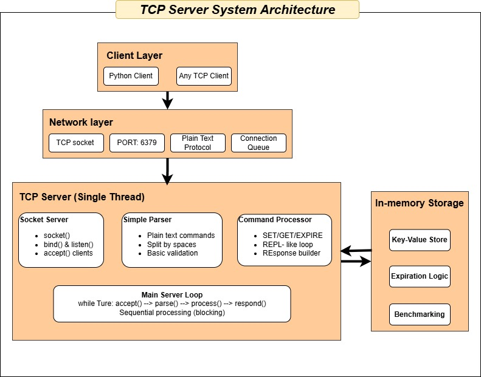

### **1. Client Layer**

* Can connect using Python client, or any TCP client
* Multiple clients **can connect**, but only one is **served at a time** (single-threaded)


### **2. Network Layer**

* **TCP/IP Protocol** over port `6379`
* **Plain text commands**: like `SET key value`, `GET key`
* One client request is processed at a time (sequential handling)

### **3. TCP Server Core**

#### Socket Server

* `socket()` → creates TCP socket
* `bind()` & `listen()` → prepares to accept connections
* `accept()` → accepts a client connection

#### Command Processing

* Parses plain text commands (split by spaces)
* Handles `SET`, `GET`, `DELETE`
* Sends responses back to the client

#### Main Loop

```python
while True:
    accept() → recv() → parse() → process() → send()
```

* Sequential and blocking processing

### **4. In-Memory Storage**

* Uses **Python dictionary** to store key-value pairs
* Supports TTL: expired keys are automatically removed
* Benchmark mode: tests with large keys and values

---

### How a TCP server works 

* **Socket Creation:** The server creates a socket for communication.

* **Binding:** The server binds that socket to a specific IP address and port.

* **Listening:** The server starts listening on that socket for new connections.

* **Accepting Connections:** When a client tries to connect, the server calls `accept()` and creates a new socket dedicated to that client.

* **Communication:** Using the new socket, the server receives data from the client with `recv()` and sends responses back with `send()`.

* **Closing:** When done, the server closes the client socket and goes back to listening for new connections.

---

### Workflow of TCP Request

- The client creates a socket and connects to the server’s IP and port.

- A three-way handshake occurs: SYN → SYN-ACK → ACK.

- Once the connection is established, the client sends requests to the server.

- The server receives data with `recv()`, processes it, and sends back responses.

- This process continues until the connection is closed.


## Workflow Diagram


### Diagram Explanation

* **Start Server**: Initializes socket on `localhost:6379`.
* **Wait for Client**: Blocks until a client connects.
* **Receive Command**: Reads input; blocks if no data.
* **Process Command**:

  * Removes expired keys.
  * Handles:

    * **SET**: Stores key-value with optional expiry.
    * **GET**: Returns value or `nil` if missing/expired.
    * **Unknown**: Sends error.
* **Client Disconnect**: Closes client socket, waits for next.
* **Shutdown**: On `Ctrl+C`, cleans up and exits.

**Note**: All actions are sequential — only one client served at a time.

3. **TCP Packet Flow**:

   
  
  

The "Single Threaded TCP Server Packet Flow" diagram shows how a TCP server works with one client at a time.

- **Start**: The server listens on a port (like 6379) for clients.
- **Client 1 Connects**: 
  - Sends `SYN` to connect, server replies with `SYN-ACK`, and Client 1 sends `ACK` to start.
  - Client 1 sends commands like `SET key value EX seconds` (server saves it and says "OK") or `GET key` (server checks and returns "value" or "nil" if expired).
  - Disconnects with `FIN-ACK`.
- **Waiting**: While Client 1 is connected, Client 2 waits (server handles only one at a time).
- **Client 2 Connects**: After Client 1 leaves, Client 2 connects with `SYN`, `SYN-ACK`, `ACK` and can send commands.
- **End**: Clients disconnect with `FIN-ACK`, and the server waits for the next client.

It’s like a single cashier serving customers one by one—others wait until the current one is done!

## System Call Tracing of a Single-Threaded TCP Server using `strace`

`strace` is a Linux tool that tracks the system calls and signals made by a program.

**Why is it used?**

* It helps monitor when a program makes system calls like `accept()`, `recv()`, `send()`, etc.

**Why use `strace` for a single-threaded TCP server?**

* To **understand the blocking behavior** of the server.
* It shows whether the server is waiting (blocking) on `accept()` while handling one client.
* Helps trace when `recvmsg`, `sendmsg`, or client disconnections occur.
  → This makes it easier to **verify the server’s sequential flow** and **debug effectively**.

  **Sturcture**
   ```bash
   sudo strace -p <PID> -e trace=accept4,recvmsg,sendmsg,clock_gettime,time -tt
   ```

   - Traces system calls (`accept4`, `recvmsg`, `sendmsg`, `clock_gettime`, `time`) with timestamps.
   - Monitors client connections, command processing, and expiration checks.


## Implementation Details

### 1. TCP Server Creation

```python
self.socket = socket.socket(socket.AF_INET, socket.SOCK_STREAM)
self.socket.bind((self.host, self.port))
self.socket.listen(1)  # Single client at a time
```

**Purpose**: 
- Creates a TCP socket and binds it to `localhost:6379`.
- The `listen(1)` call ensures only one client is handled at a time, enforcing single-threaded behavior.

### 2. Client Handling Loop

```python
while True:
    client_socket, client_address = self.socket.accept()
    self.handle_client(client_socket)
```

**Purpose**:
- Accepts a client connection and processes its requests fully before accepting the next client.
- Ensures sequential processing of clients.

### 3. In-Memory Dictionary Store

```python
self.storage: Dict[str, str] = {}      # Key-value store
self.expire: Dict[str, float] = {}     # Expiry timestamps for keys
```

**Purpose**:
- Uses Python dictionaries to store key-value pairs and their expiration timestamps in memory.
- Simulates Redis’s in-memory data store.

### 4. Command Parsing (`SET`, `GET`, `EXPIRE`)

```python
def process_command(self, command: str) -> str:
    parts = command.split()
    cmd = parts[0].upper()
    if cmd == "SET": return self.handle_set(parts[1:])
    elif cmd == "GET": return self.handle_get(parts[1:])
```

**Purpose**:
- Parses commands like `SET key value EX seconds` or `GET key`.
- Routes commands to appropriate handlers, supporting case-insensitive input.

### 5. Expiration Logic

```python
def cleanup_expired_keys(self):
    now = time.time()
    expired_keys = [k for k, exp in self.expire.items() if exp <= now]
    for key in expired_keys:
        self.storage.pop(key, None)
        self.expire.pop(key, None)
```

**Purpose**:
- Checks for expired keys before processing commands.
- Removes expired keys from both `storage` and `expire` dictionaries.

### 6. Interactive REPL Mode (`client.py`)

```python
def interactive_mode(self):
    command = input(f"{self.host}:{self.port}> ").strip()
    response = self.send_command(command)
```

**Purpose**:
- Provides a Redis-like CLI for real-time interaction with the server.
- Supports commands like `SET`, `GET`, and `EXPIRE`.

### 7. Benchmarking with Large Keys

```python
def benchmark_mode(self):
    key_sizes = [1, 5, 10]
    value_sizes = [10, 50, 100]
    repeat = 5
    ...
    start = time.time()
    self.socket.send((f"SET {key} {value}\n").encode('utf-8'))
    self.socket.recv(4096)
    total_set += (time.time() - start)
```

**Purpose**:
- Tests server performance with varying key-value sizes.
- Measures average time for `SET` and `GET` operations to evaluate efficiency.

## Testing the TCP Server

### Step 1: Start the Server

**NOTE** “All test must be done inside the `single_threaded_lab1_2` directory.”

```bash
python3 server.py &
```

- Runs the server in the background on `localhost:6379`.
- The `&` keeps the terminal usable.

**Expected Output**:

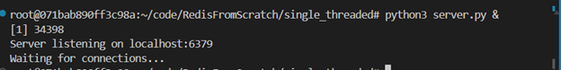

### Step 2: Monitor with `strace`

1. **Install `strace`** (if not installed):
   ```bash
   sudo apt update
   sudo apt install strace
   ```

2. **Find Server PID**:
   ```bash
   ps aux | grep python3
   # or
   pidof python3
   ```

   **Expected Output**:

   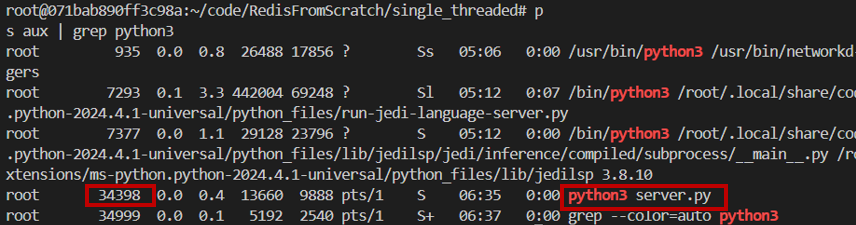

   - Shows the server’s process ID (e.g., `34398` for `server.py`).

3. **Run `strace`**:

   ```bash
   sudo strace -p <PID> -e trace=accept4,recvmsg,sendmsg,clock_gettime,time -tt
   ```
   **Expected Output**:

   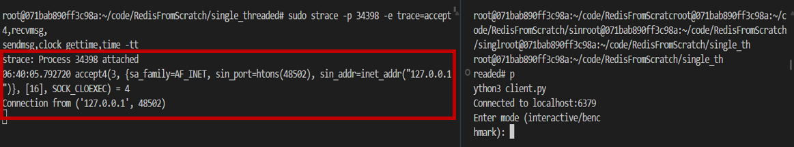


  Here, 
  - `strace` is already attached to the server process before the client connects. When the client connects, the server runs the accept4 system call to accept that connection. Since strace is already monitoring the server, it captures and shows the accept4 call in real time.

  - When  run `client.py`, it asks:

    `Enter mode (interactive/benchmark):`

    Here, use interactive mode.

    #### **Interactive Mode**

    * Lets you type commands like `SET key value`, `GET key`, etc.
    * You enter each command manually.
    * Best for testing and debugging.

    #### **Benchmark Mode (Large Keys)**

    * Sends many large `SET`/`GET` requests automatically.
    * Each key or value is big in size (e.g., long strings).
    * Used to test how the server handles **heavy data** and **memory usage**.
    * Helps check speed and limits when dealing with large data.
---


  ```bash
  06:40:05.792720 accept4(3, {sa_family=AF_INET, sin_port=htons(48502), sin_addr=inet_addr("127.0.0.1")}, [16], SOCK_CLOEXEC) = 4
  ```

*  `06:40:05.792720` — Time when the server accepted a connection.

*  `accept4` — A system call that accepts a new client connection on the server's listening socket.

*  `3` — The file descriptor for the server’s listening socket.

*  `127.0.0.1:48502` — The client’s IP and port (client is running on the same machine).

*  `SOCK_CLOEXEC` — A flag to auto-close this connection if the server restarts another program (for safety).

*  `= 4` — A new file descriptor created for this client. The server will now use this to talk to that client.

This line shows that the server accepted a connection from a local client (127.0.0.1) and is ready to communicate with it using a new socket. 

Sure! Here's the English version of your note:

---

* **Expand the list of traced system calls**

```bash
sudo strace -p 34398 -e trace=network,time -tt
```

`trace=network` → Tracks all **network-related** system calls like `accept`, `recv`, `send`, `recvmsg`, `sendmsg`, etc.

`trace=time` → Tracks all **time-related** system calls like `clock_gettime`, `gettimeofday`, `time`, and others.

**Output**

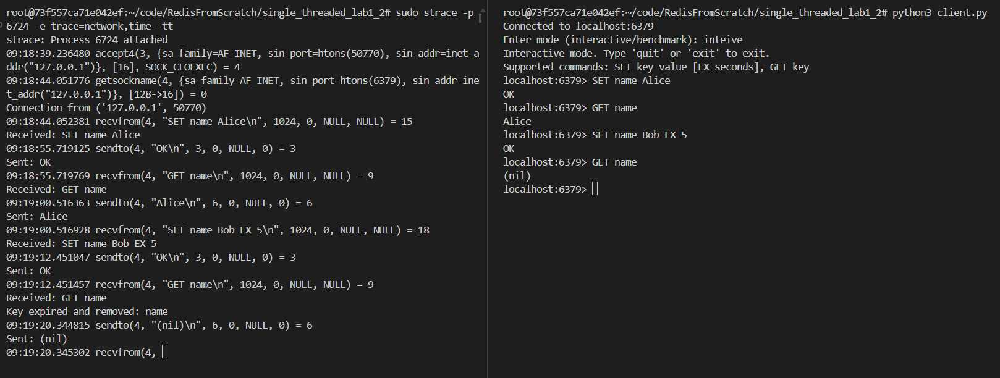


* **System call latency (how much time each call takes):**

```bash
sudo strace -T -p <PID>
```
**Output**

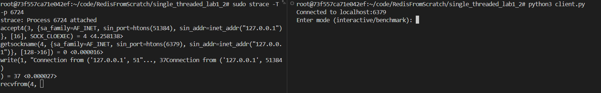

Shows how many microseconds each system call takes.

* **Summary of how many times each call occurred:**

```bash
sudo strace -c -p <PID>
```
**Output**

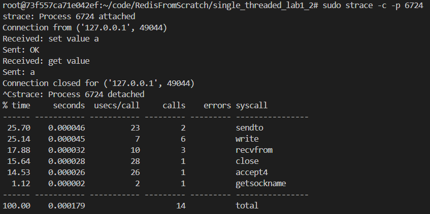

Provides a summary report (how many times each syscall was made and what % of total time it consumed).

* **Full trace with file operations, memory calls, etc.:**

```bash
sudo strace -f -tt -v -s 2000 -o full.log -p <PID>
```
Captures a detailed log of everything (file ops, memory, syscall arguments) into a large log file `full.log`.


### Step 3: Test with Multiple Clients

1. Open multiple terminal windows.
2. In each terminal, run:
   ```bash
   python3 client.py
   ```
3. Enter commands like `SET key value` or `GET key` in interactive mode.
4. Observe:
   - The first client connects and holds the server.
   - Subsequent clients wait (block) until the first client disconnects (e.g., via `exit`).
5. Check `strace` output:
   - Shows `accept4` for the first client, followed by `recvmsg` and `sendmsg`.
   - Next `accept4` occurs only after the first client disconnects, confirming single-threaded behavior.

**Expected Outputs**:

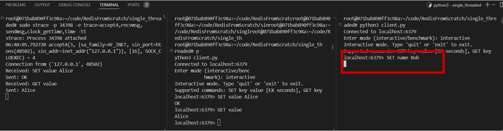

Even though the client in the middle terminal successfully connects to the server and transfers data, the client in the third terminal cannot connect and communicate with the server until the previous client disconnects. This happens because the server is single-threaded and handles only one client at a time.

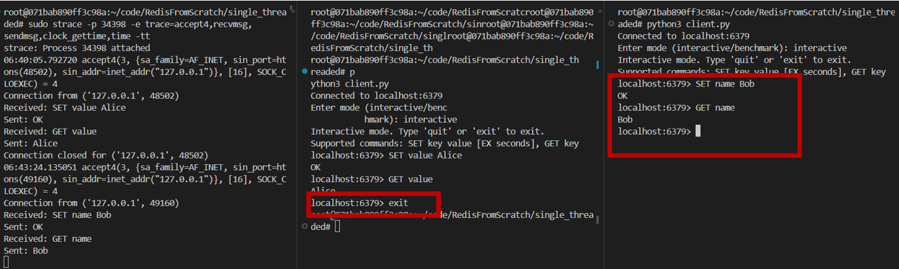

As soon as the previous client disconnects, the client in the third terminal is able to connect to the server and start transferring data.

summary:
- **strace Terminal**: Logs `accept4`, `recvmsg`, `sendmsg`, `clock_gettime`, and `time` calls.
- **Client 1**: Executes `SET` and `GET` commands, including expiration logic (`EX`).
- **Client 2**: Blocked until Client 1 exits, confirming single-threaded behavior.

Additional Outputs:

- **SET/GET Commands**:

  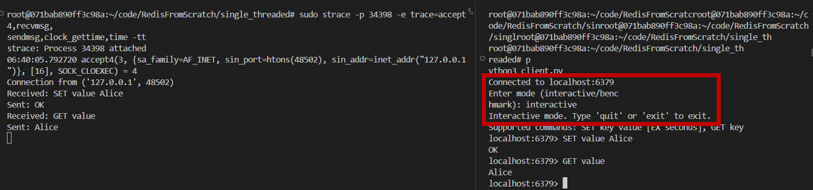


  In the output, the right terminal shows the client entering **interactive mode** after choosing it (`interactive`).

  In this mode, type commands manually like:

  * `SET value Alice` → stores the value "Alice"
  * `GET value` → retrieves the value

  The left terminal (server side) shows how the server receives and processes those commands. This mode is useful for testing command responses one at a time.


- **Benchmark Results**:

  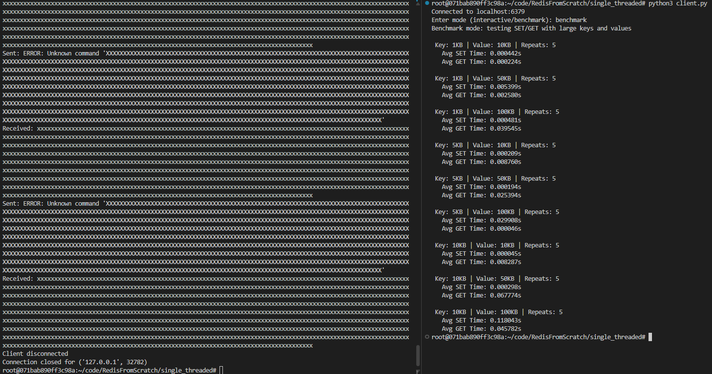

  The snapshot shows the **client testing the server in benchmark mode** with large keys and values (1KB to 100KB).

  * The client sends `SET` and `GET` commands multiple times to measure speed.
  * The server shows `ERROR: Unknown command` because large inputs may not match the expected format (`ERROR: Unknown command` usually occurs because the server reads partial commands from the TCP stream, which is a limitation of the server’s input handling).
  * The long lines of `xxxxx...` represent the large key-value data.
  * Since the server is **single-threaded**, it handles one request at a time and can't properly process malformed or oversized inputs.
  * After each test, the client disconnects, and the server shows `client disconnected`.

  ###  SET vs GET Time (Based on Data Size)

  * For **small sizes (1KB–5KB)**: both `SET` and `GET` are fast.
  * For **larger sizes (10KB–100KB)**:

    * `SET` time increases more due to writing large data.
    * `GET` is faster than `SET`, as it only reads data.

  ---


- **Expiration Logic**:

  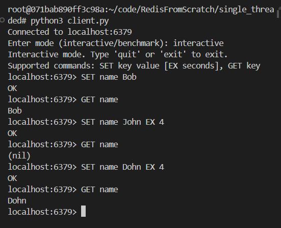

  This section declare that, the `SET key value EX seconds` command can be used to set an expiration time for a piece of data. Once the set time has passed, the `GET` command returns `(nil)` (meaning no data), which proves that the expiration feature is working successfully. If the data is accessed within its expiration time, the value is returned."


## Handling Port Conflicts

If port `6379` is already in use:

1. **Check Port Usage**:
   ```bash
   sudo netstat -tulnp | grep 6379
   ```
   - Lists processes using port `6379`.

2. **Kill Conflicting Process**:
   ```bash
   sudo kill -9 <PID>
   ```
   - Replace `<PID>` with the process ID from the previous step.

3. **Restart Server**:
   ```bash
   python3 server.py &
   ```


# Flame Graph Generation & Analysis for Single-Threaded TCP Server

## Prerequisites

Update your system and install `pip` if not already installed:

```bash
sudo apt update
sudo apt install python3-pip
```


## Step-by-Step: Generate Flame Graph using `py-spy`

---

### Step 1: Install `py-spy`

Install it using `pip`:

```bash
pip install py-spy
```

---

### Step 2: Start TCP Server

Run your server (background execution preferred):

```bash
python3 server.py &
```

---

### Step 3: Find the Server's PID

Use `pidof` to find the process ID:

```bash
pidof python3
```
---

### Step 4: Record the Flame Graph

Record a profile of the server using `py-spy`:

```bash
py-spy record -p <PID> -o profile.svg 
```

> This generates a `profile.svg` flame graph file based on sampled stack traces.

---

### Step 5: View the Flame Graph

Open the `profile.svg` file by downloading the file.


## Sample Flame Graph Analysis (Single-Threaded TCP Server with 5 Clients)

**Output**

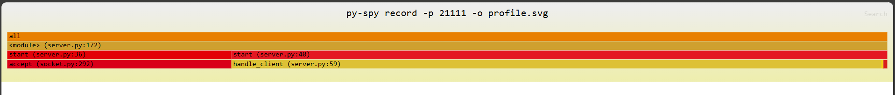

### Flame Graph Key Observations

1. **`<module>` (Line 172)**

   * The main entry point: `SimpleTCPServer().start()`

2. **`start()` Function (Line 36)**

   * The server’s main loop (`while True:`).
   * Widest and most intense (red) block, indicating high CPU time.

3. **`accept()` Call (Line 40)**

   * Blocking call for incoming connections.
   * Wide and red → server waits here most of the time.
   * Indicates idle time due to one-at-a-time connection handling.

4. **`handle_client()` (Line 59)**

   * Processes individual client requests.
   * Narrower bars (yellow/orange) → executes fast.
   * Suggests efficient request handling or low workload.

---

## Issues Identified from Flame Graph

---

1. **Single-threaded Model**

   * Only one client is processed at a time.
   * Other clients are blocked until the current one completes.

2. **Blocking I/O (recv/send)**

   * Slow clients can block the server, reducing throughput.

3. **Inline `cleanup_expired_keys()`**

   * Runs on every request — may become expensive if key count grows.
   * Not a major issue now, but may degrade performance over time.

---

## Flame Graph Summary — Time Consumption Breakdown

| Component                        | Time Consumption | Explanation                                                                                                          |
| -------------------------------- | ---------------- | -------------------------------------------------------------------------------------------------------------------- |
| `accept()` (socket.py:292)       | 🟥 Highest       | Blocks while waiting for a new client. Since the server is single-threaded, it can only handle one client at a time. |
| `start()` (server.py:36/40)      | 🟧 High          | This is the main server loop. It calls `accept()`, so it also appears to take significant time.                      |
| `handle_client()` (server.py:59) | 🟨 Moderate      | Processes client commands. Takes less time since the client sends few commands or the processing is lightweight.     |
| `recv()` / `send()`              | 🟩 Low           | Handles data reception/transmission. Minimal time spent due to fewer or smaller messages from the client.            |
| `cleanup_expired_keys()`         | 🟩 Very Low      | Not much time spent currently since there aren’t many expired keys. Time might increase as the number of keys grows. |

---

### Additional Notes (Not clearly visible in Flame Graph):

* **`recv()` / `send()`**: These happen inside `handle_client()`. Since the graph doesn't break down `handle_client()` further, their time isn't separately visible. If larger data is sent/received, this portion would widen.

* **`cleanup_expired_keys()`**: Also called inside `handle_client()`. Since it doesn't appear distinctly in the graph, it likely takes very little time now. With many expired keys, its time would increase and become more visible.

---

## Conclusion

This project successfully implemented a single-threaded TCP server that mimics basic Redis functionality. Key features include:
- A TCP server handling one client at a time using Python’s `socket` module.
- Support for `SET`, `GET`, and `EXPIRE` commands with an in-memory dictionary store.
- Expiration logic for keys using the `EX` parameter.
- Performance benchmarking for large key-value pairs.
- Verification of single-threaded behavior using `strace` and multiple clients.

