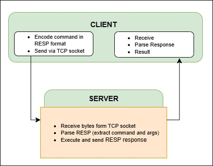

# Building a Single-Threaded TCP Server for Redis from Scratch with Command Parser and RESP Protocol

In this lab,  single-threaded TCP server focus on integrating a **Command Parser** and **RESP Protocol**. 

## Objectives

- Implement a **Command Parser** to process REPL-like commands for `SET`, `GET`, and `EXPIRE`.
- Integrate **RESP Protocol** for command and response formatting.


## Key Concepts

## What is RESP (Redis Serialization Protocol)?

**RESP (Redis Serialization Protocol)** is a **simple, fast, and text-based protocol** used for communication between a Redis client and server.

**Why RESP is needed:**

* It helps client and server talk in a clear, simple way.
* Makes sending and reading data fast and easy.
* Supports different types of data (like text, numbers, lists).
* Keeps communication efficient over TCP.

**Why a command parser is needed in a TCP server:**

* To read and understand the commands sent by the client.
* To check if commands are correct.
* To run the commands and send back answers.
* Without parsing, the server can’t know what the client wants.


### **RESP (REdis Serialization Protocol)** format for `SET` and `GET` commands:

### `SET key value` Command – RESP Format

#### Command:

```bash
SET key value
```

#### RESP Representation:

```
*3\r\n                → Indicates 3 parts (SET, key, value)
$3\r\nSET\r\n         → First part: SET (length 3)
$3\r\nkey\r\n         → Second part: key (length 3)
$5\r\nvalue\r\n       → Third part: value (length 5)
```

###  `GET key` Command – RESP Format

#### Command:

```bash
GET key
```

#### RESP Representation:

```
*2\r\n                → Indicates 2 parts (GET, key)
$3\r\nGET\r\n         → First part: GET (length 3)
$3\r\nkey\r\n         → Second part: key (length 3)
```

Here, 

| Command         | RESP Format                                       | Part Count | Purpose                     |
| --------------- | ------------------------------------------------- | ---------- | --------------------------- |
| `SET key value` | `*3\r\n$3\r\nSET\r\n$3\r\nkey\r\n$5\r\nvalue\r\n` | 3          | Set a value for a key       |
| `GET key`       | `*2\r\n$3\r\nGET\r\n$3\r\nkey\r\n`                | 2          | Retrieve the value of a key |


## What is a Command Parser?

A **Command Parser** is the logic or module that reads the RESP-encoded input from a client, and **extracts the command and its arguments** in usable form.

**Command Parser necessities:**

* To decode RESP-encoded data correctly.
* To identify which command the client sent.
* To extract command arguments properly.
* To enable the server to understand and execute client requests.

**Why command parser is needed in a TCP server:**

* TCP only delivers raw byte streams, not structured commands.
* Server needs to convert raw data into meaningful commands.
* Without parsing, the server can’t know what action to perform.
* It ensures correct communication and command execution between client and server.


###  How both work together (system diagram) :



Explanation:

**Client:**

* Converts user commands into RESP format.
* Sends the RESP data over a TCP connection to the server.
* Receives RESP responses from the server.
* Decodes and shows the result to the user.

**Server:**

* Receives raw bytes from the client via TCP.
* Parses the RESP data to get commands and arguments.
* Executes the commands.
* Sends the results back to the client in RESP format.


## Project Structure

```
RedisFromScratch/TCP_Server/
├── server.py       # TCP server implementation with Command Parser and RESP
├── client.py       # Client script for testing

```


## Implementation Details

**RESP Protocol Support**:

* A `parse_resp` function has been added to the server, which parses Redis-style RESP commands (e.g., `*3\r\n$3\r\nSET\r\n$3\r\nkey\r\n$5\r\nvalue\r\n`).
* A `serialize_resp` function has been added to the server, which serializes responses into RESP format (e.g., `+OK\r\n`, `$-1\r\n`, or `$5\r\nvalue\r\n`).
* A `serialize_command` function has been added to the client, which serializes commands into RESP format.
* A `parse_response` function has been added to the client, which parses RESP responses received from the server.


## Monitoring and Performance Analysis of RESP Commands

1. **Network Traffic Check:** Capture RESP command data packets (e.g., `*3\r\n$3\r\nSET\r\n...`) using **`tcpdump`**  or **`tshark`**.

2. **Process Tracing:** Use **`strace`** or **`ltrace`** to monitor the server’s `recv` and `send` calls and observe command parsing time.

3. **Performance Tuning:** Use **`perf`** to check CPU or memory usage and find opportunities for optimization.

### Terminal 1: Start Server
```bash
python3 server.py &

```
### Terminal 2: Start client
```bash
python3 client.py
```

**Interactive Mode**: Allows users to easily input commands, which are internally converted into RESP.

**Benchmark Mode**: Tests performance with large data sizes using the RESP protocol.


### Tools: 

# 1. **tcpdump – Packet-Level RESP Traffic Analysis**

* Capture raw TCP packets between Redis client and server.
* View RESP command data (e.g., `*3\r\n$3\r\nSET\r\n...`) in ASCII.
* Debug network transmission or verify correct RESP framing.


### Install

```bash
sudo apt update
sudo apt install tcpdump
```

### Run

```bash
sudo tcpdump -i lo port 6379 -A
```

* `-i lo` → capture on the loopback interface.
* `port 6379` → filter Redis server traffic.
* `-A` → display packet contents in ASCII (shows RESP text).

---

### Sample Output & Explanation

#### 1. TCP Handshake

```
14:44:55.185579 IP localhost.40920 → localhost.6379: Flags [S], …
14:44:55.185632 IP localhost.6379 → localhost.40920: Flags [S.], …
14:44:55.185664 IP localhost.40920 → localhost.6379: Flags [.], ACK …
```

* **SYN**, **SYN-ACK**, **ACK** packets establish the TCP connection.


####  2. `SET name Alice EX 5`

```
14:45:11.022612 … length 49: RESP "SET" "name" "Alice" "EX" "5"
Received RESP: ['SET', 'name', 'Alice', 'EX', '5']
Key expired and removed: name
Sent RESP: OK
14:45:11.023748 … length 5: +OK
```

* Client sends a 5-element RESP array.
* Server processes expiry logic immediately (in this lab, expiry check is logged before OK).
* Server replies `+OK`.

#### 3. `GET name` (before expiry)

```
14:45:13.326821 … length 23: RESP "GET" "name"
Received RESP: ['GET', 'name']
14:45:13.327159 … length 11: RESP "Alice"
Sent RESP: Alice
```

* Server finds the key and returns its value as a bulk string.


#### 4. `GET name` (after expiry)

```
14:45:19.444819 … length 23: RESP "GET" "name"
Received RESP: ['GET', 'name']
Key expired and removed: name
14:45:19.445319 … length 5: RESP null ($-1)
Sent RESP: (nil)
```

* The key has expired; server logs deletion.
* Server replies with a Null Bulk String (`$-1`).

---

####  5. TCP connection close

```
14:45:21.563801 … Flags [F.], …
14:45:21.567044 … Flags [F.], …
14:45:21.567123 … Flags [.], ACK …
```

* **FIN**, **ACK** packets close the TCP connection gracefully.

---

# 2. **tshark – Text-based Wireshark for RESP TCP Analysis**

To capture, filter, and inspect Redis TCP packets with detailed protocol info and readable RESP data for debugging network and protocol issues.

### Install

```bash
sudo apt update
sudo apt install tshark
```
### Run: 

```bash
sudo tshark -i lo port 6379
```

* `-i lo` → captures packets from the loopback interface (localhost).
* `port 6379` → filters to capture only packets on Redis server port 6379.


### Output: 
### TCP connection handshake:

```
    1 0.000000000    127.0.0.1 → 127.0.0.1    TCP 74 53680 → 6379 [SYN] Seq=0 Win=65495 Len=0 MSS=65495 SACK_PERM=1 TSval=1031967534 TSecr=0 WS=128
    2 0.000041309    127.0.0.1 → 127.0.0.1    TCP 74 6379 → 53680 [SYN, ACK] Seq=0 Ack=1 Win=65483 Len=0 MSS=65495 SACK_PERM=1 TSval=1031967534 TSecr=1031967534 WS=128
    3 0.000067611    127.0.0.1 → 127.0.0.1    TCP 66 53680 → 6379 [ACK] Seq=1 Ack=1 Win=65536 Len=0 TSval=1031967534 TSecr=1031967534
```
SYN, SYN-ACK, ACK packets establish the TCP connection between client and server.

### SET command: `SET name Alice EX 4`

```
Received RESP: ['SET', 'name', 'Alice', 'EX', '4']
Sent RESP: OK
```
### TCP Packet Details (SET Command):

```
    4 17.901485811    127.0.0.1 → 127.0.0.1    TCP 115 53680 → 6379 [PSH, ACK] Seq=1 Ack=1 Win=65536 Len=49 TSval=1031985436 TSecr=1031965434
    5 17.901515688    127.0.0.1 → 127.0.0.1    TCP 66 6379 → 53680 [ACK] Seq=1 Ack=50 Win=65536 Len=0 TSval=1031985436 TSecr=1031985436
    6 17.902601618    127.0.0.1 → 127.0.0.1    TCP 71 6379 → 53680 [PSH, ACK] Seq=1 Ack=50 Win=65536 Len=5 TSval=1031985437 TSecr=1031985436
    7 17.902613856    127.0.0.1 → 127.0.0.1    TCP 66 53680 → 6379 [ACK] Seq=50 Ack=6 Win=65536 Len=0 TSval=1031985437 TSecr=1031985437
```

* The `PSH` flag indicates that data is being sent in this packet.
* The `ACK` packets confirm the data was received successfully.

---

### Redis `GET` Command and Response:  `GET name`

```
Received RESP: ['GET', 'name']
Sent RESP: Alice
```
### TCP Packet Details (GET Command):

```
    8 20.106670452    127.0.0.1 → 127.0.0.1    TCP 89 53680 → 6379 [PSH, ACK] Seq=50 Ack=6 Win=65536 Len=23 TSval=1031987641 TSecr=1031985437
    9 20.106699736    127.0.0.1 → 127.0.0.1    TCP 66 6379 → 53680 [ACK] Seq=6 Ack=73 Win=65536 Len=0 TSval=1031987641 TSecr=1031987641
   10 20.107039422    127.0.0.1 → 127.0.0.1    TCP 77 6379 → 53680 [PSH, ACK] Seq=6 Ack=73 Win=65536 Len=11 TSval=1031987641 TSecr=1031987641
   11 20.107053054    127.0.0.1 → 127.0.0.1    TCP 66 53680 → 6379 [ACK] Seq=73 Ack=17 Win=65536 Len=0 TSval=1031987641 TSecr=1031987641
```

### After GET Command, When Key Has Expired:

```
Received RESP: ['GET', 'name']
Key expired and removed: name
Sent RESP: (nil)
```

* After 4 seconds, the key has expired.
* Server responds with `(nil)` indicating the key is no longer available.

### TCP Connection Close:

```
   16 29.708155893    127.0.0.1 → 127.0.0.1    TCP 66 53680 → 6379 [FIN, ACK] Seq=96 Ack=22 Win=65536 Len=0 TSval=1031997243 TSecr=1031992711
   17 29.709572356    127.0.0.1 → 127.0.0.1    TCP 66 6379 → 53680 [FIN, ACK] Seq=22 Ack=97 Win=65536 Len=0 TSval=1031997244 TSecr=1031997243
   18 29.709596888    127.0.0.1 → 127.0.0.1    TCP 66 53680 → 6379 [ACK] Seq=97 Ack=23 Win=65536 Len=0 TSval=1031997244 TSecr=1031997244
```

* FIN packets are exchanged to close the TCP connection gracefully.

---


# 3. **strace – Syscall Tracing for RESP-Level Redis Debugging**

* Trace **syscalls** made by the Redis server process (like `accept`, `recvfrom`, `sendto`).
* View exact RESP command strings received and responses sent.
* Great for debugging **internal server logic**, **RESP parsing**, or **expiration behavior**.

### Install

```bash
sudo apt update
sudo apt install strace
```

### Run:

```bash
sudo strace -e trace=network,time -s 128 -p <pid>
```

* `-e trace=network,time` → only trace **network**-related syscalls and timestamp each.
* `-s 128` → show up to 128 characters of each buffer (increase if needed).
* `-p <pid>` → attach to running Redis-like server (e.g., your Lab 3 server).


### Sample Output & Analysis

### TCP Connection:

```c
accept4(3, {sa_family=AF_INET, sin_port=htons(40960), sin_addr=inet_addr("127.0.0.1")}, [16], SOCK_CLOEXEC) = 4
getsockname(4, {sa_family=AF_INET, sin_port=htons(6379), sin_addr=inet_addr("127.0.0.1")}, [128->16]) = 0
```

* Server accepts connection on socket 4 from client `127.0.0.1:40960`.

### SET Command: `SET name Alice EX 5`

```c
recvfrom(4, "*5\r\n$3\r\nSET\r\n$4\r\nname\r\n$5\r\nAlice\r\n$2\r\nEX\r\n$1\r\n5\r\n", 1024, 0, NULL, NULL) = 49
Received RESP: ['SET', 'name', 'Alice', 'EX', '5']
sendto(4, "+OK\r\n", 5, 0, NULL, 0) = 5
Sent RESP: OK
```

* Full RESP message is received in one `recvfrom` call.
* Server parses it successfully and responds with `+OK`.

### GET Command (Before Expiration): `GET name`

```c
recvfrom(4, "*2\r\n$3\r\nGET\r\n$4\r\nname\r\n", 1024, 0, NULL, NULL) = 23
Received RESP: ['GET', 'name']
sendto(4, "$5\r\nAlice\r\n", 11, 0, NULL, 0) = 11
Sent RESP: Alice
```

* Client asks for the value of `"name"`.
* Server replies with `Alice` using a RESP bulk string.

### GET Command (After Expiration)

```c
recvfrom(4, "*2\r\n$3\r\nGET\r\n$4\r\nname\r\n", 1024, 0, NULL, NULL) = 23
Received RESP: ['GET', 'name']
Key expired and removed: name
sendto(4, "$-1\r\n", 5, 0, NULL, 0) = 5
Sent RESP: (nil)
```

* Server detects expiration of key `"name"`.
* Sends RESP null (`$-1\r\n`), meaning key doesn't exist.

### TCP Connection Close:

```c
recvfrom(4, "", 1024, 0, NULL, NULL) = 0
Connection closed for ('127.0.0.1', 40960)
```

* `recvfrom` returns 0 → client closed the connection.
* Server logs connection close and returns to listening.

---


# 3. `ltrace` – Library Call Tracing for RESP Command Parsing

* `ltrace` is a powerful Linux debugging tool that traces C library function calls (like `read`, `write`, `memcpy`).


### **Install**

```bash
sudo apt update
sudo apt install ltrace
```
### **Start Server**

   ```bash
   python server.py
   ```
* **Run `ltrace` on the Server Process**

   ```bash
   sudo ltrace -p <server_pid>
   ```

* **Use the Client to Send Commands**
   ```
   SET name Alice EX 4
   GET name
   ```

### Expected Output 

```text
accept(3, 0x7fff..., 0x7fff..., 0) = 4
recv(4, "*5\r\n$3\r\nSET\r\n$4\r\nname\r\n$5\r\nAlice\r\n$2\r\nEX\r\n$1\r\n4\r\n", 1024) = 49

memcpy(..., "SET", 3)      = ...
memcpy(..., "name", 4)     = ...
memcpy(..., "Alice", 5)    = ...
memcpy(..., "Ex", 2)       = ...
memcpy(..., "4", 1)        = ...

write(1, "Received RESP: ['SET', 'name', 'Alice', 'EX', '4']\n", 51) = 51
send(4, "+OK\r\n", 5, 0) = 5
write(1, "Sent RESP: OK\n", 14) = 14

recv(4, "*2\r\n$3\r\nGET\r\n$4\r\nname\r\n", 1024) = 23
write(1, "Received RESP: ['GET', 'name']\n", 31) = 31
send(4, "$5\r\nAlice\r\n", 11, 0) = 11
write(1, "Sent RESP: Alice\n", 17) = 17

[After 4 seconds – key expires]
recv(4, "*2\r\n$3\r\nGET\r\n$4\r\nname\r\n", 1024) = 23
write(1, "Key expired and removed: name\n", 30) = 30
send(4, "$-1\r\n", 5, 0) = 5
write(1, "Sent RESP: (nil)\n", 17) = 17

close(4) = 0
write(1, "Connection closed for ('127.0.0.1', 40978)\n", 43) = 43
```

---

### **Explanation of Key Function Calls**


*  `accept()`  Accepts a new client connection                                                     
* `recv()`   Receives raw RESP data from the client                                              
*  `memcpy()` Copies parts of the command like `"SET"`, `"name"`, `"Alice"`  
*  `write()`  Outputs logs to the terminal 
*  `send()`    Sends a RESP-compliant response back to the client 
*  `close()`   Closes the connection after the command sequence  

---

###  **Tracking Key Expiration** `SET name Alice EX 4`

* The server stores the key with a TTL (time to live) of 4 seconds.
* Once expired:

  * The next `GET name` logs: `Key expired and removed: name`
  * Sends a RESP nil reply: `$-1\r\n`

---


## Flame Graph Generation & Analysis

### Prerequisites
```bash
sudo apt update
sudo apt install perl

sudo apt update
sudo apt install python3-pip
pip install py-spy

```

**Install tools:**

   ```bash
   git clone https://github.com/brendangregg/FlameGraph.git
   ```

**Terminal (Start server):**

   ```bash
   python3 server.py &
   ```

3. **Generate load:**

   ```bash
  python3 -c "import socket, time; 
  for i in range(10): 
      s = socket.socket(); 
      s.connect(('localhost', 6379)); 
      s.send(b'*5\r\n$3\r\nSET\r\n$4\r\nname\r\n$5\r\nAlice\r\n$2\r\nEX\r\n$1\r\n4\r\n'); 
      s.recv(1024); 
      s.close(); 
      time.sleep(0.2)" &

   ```

4. **Profile & generate flamegraph:**

   ```bash
   py-spy record --format raw -o profile.raw -d 15 -p $(pgrep -f "python3 server.py")
   ./FlameGraph/flamegraph.pl profile.raw > correct_flamegraph.svg
   ```

5. **View in browser:**

   ```bash
   python3 -m http.server 8000
   ```

   Open: [http://localhost:8000/correct\_flamegraph.svg](http://localhost:8000/correct_flamegraph.svg)


---